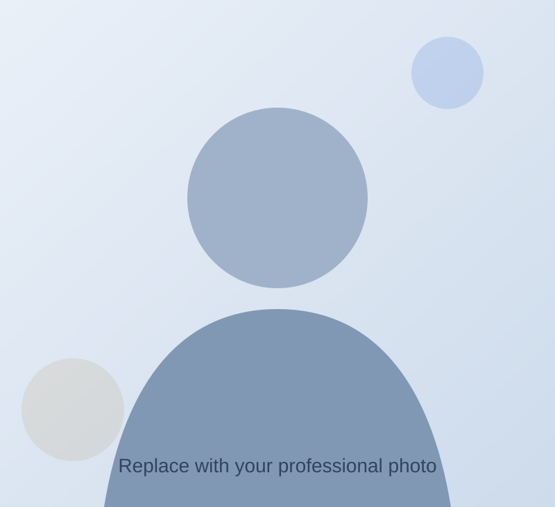

# Obyedul Haque Efty — Academic Portfolio

A lightweight static personal website designed for GitHub Pages.

## Files

- `index.html` — website content
- `styles.css` — design and responsive layout
- `script.js` — mobile menu, reveal animation, automatic copyright year
- `assets/profile-placeholder.svg` — replace this with your photo
- `assets/Obyedul_Haque_Efty_CV.pdf` — add your current CV using this exact filename

## Before publishing

### 1. Replace your profile photo
Put your photo inside `assets/`, for example:

`assets/profile.jpg`

Then in `index.html`, change:

```html

```

to:

```html

```

### 2. Add your CV
Copy your CV PDF into `assets/` and rename it exactly:

`Obyedul_Haque_Efty_CV.pdf`

### 3. Check your links
Search `index.html` for:
- `linkedin.com/in/efty75`
- `github.com/efty75`
- `orcid.org`

Update any link that is not correct.

### 4. GitHub Pages repository
For a personal user site, use a repository named:

`YOUR-USERNAME.github.io`

Example:
`efty75.github.io`

Upload the website files to the repository root.

## Local preview

Simply open `index.html` in a browser.

For the best local preview in VS Code, install the "Live Server" extension and click **Go Live**.
